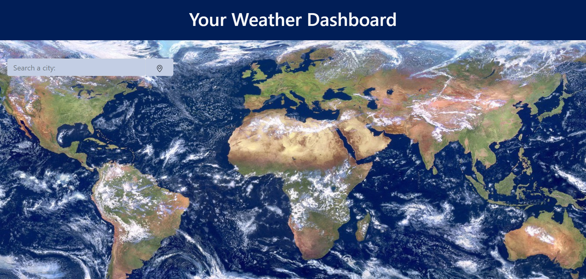

# weather-dashboard
A compact weather dashboard application 

## Description

The Weather Dashboard is a light weight, compact weather mapping application that utilizes Open Weather Map (OWM) API. OWM provides the application with JSON data that utilizes specific user search criteria in order to provide up-to-date, real-time weather data for any given city within a 5-day period. 

The Weather Dashboard is powered through Javascript/Jquery and the OWM API. It contains some HTML and CSS elements, but is generated predominantly through dynamic JS language. Bootstrap was also used for the foundation of the browser's styling, although many parts of the page contained their own css elements. 

As a future add-on to this project, I would like to include a list of serach criteria inputs that the user can select from. These inputs will be used to navigate between different locations of API data object. For instance, if the user wants to see the average level of rainfall on a given day in a given city, they could simply select that argument from a list of options.

## Links

[Github](https://github.com/jonathanstoll0603/weather-dashboard)

[Web page](https://jonathanstoll0603.github.io/weather-dashboard/)

[LinkedIn](https://www.linkedin.com/in/jonathan-stoll-092351133/)

## Contact Information

Name: Jonathan Stoll

Email: Jonathanstoll0603@gmail.com

Phone: (678)-358-4384

## License

MIT License